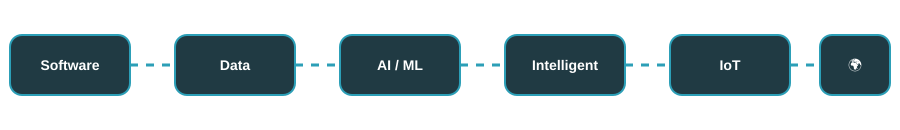
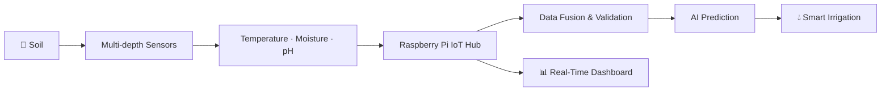
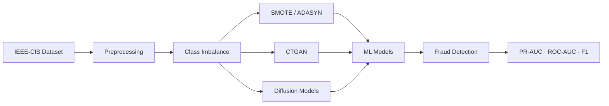

<!-- ===================== HEADER ===================== -->

 

  

 

<!-- ===================== ABOUT ===================== -->
## 👋 About Me

I'm **Mohamed Amine**, a **Software Developer** and **Master's student in Artificial Intelligence and Digitalization** at **Ibn Khaldoun University of Tiaret, Algeria**.

I build systems where **software, AI, data and real-world applications meet**: from web and mobile apps to machine learning pipelines, IoT platforms and digital twins.

| | |
|:--|:--|
| 🎓 **Education** | Master 2 – Artificial Intelligence & Digitalization, Université Ibn Khaldoun de Tiaret |
| 💼 **Now** | Software & Digital Solutions at **Tassyir Digital Agency** |
| 🧠 **Previously** | AI Intern at **SIINE Academy** |
| 🔭 **Focus** | AI · Software Development · Data Science · IoT · Digital Twins |
| 🌍 **Languages** | Arabic · French · English |

 

<!-- ===================== FEATURED ===================== -->
## 🌾 Featured Project

### Real-Time Monitoring and Autonomous Smart Irrigation Based on Soil Moisture Profiling

An **IoT + AI agricultural platform** that builds a multi-depth representation of soil conditions and drives intelligent irrigation decisions.

| Capability | Details |
|:--|:--|
| 🌱 **Soil monitoring** | Multi-depth sensing for agricultural environments |
| 📡 **Connectivity** | Wireless sensor network over NRF24L01 |
| 🧠 **Intelligence** | AI-based prediction for adaptive irrigation |
| 🖥️ **Edge hub** | Raspberry Pi as the central IoT processing unit |
| 📊 **Visualization** | Real-time dashboard with soil profiling |
| 🔎 **Reliability** | Data fusion and sensor validation to flag unreliable readings |
| 🌍 **Impact** | Designed for semi-arid agriculture and water optimization |

<!-- ===================== RESEARCH ===================== -->
## 💳 AI Research Project

### Enhancing Fraud Detection Through Synthetic Tabular Data Augmentation

Improving **financial fraud detection** with synthetic data generation and machine learning on the **IEEE-CIS Fraud Detection** dataset.

- ⚖️ Severe class imbalance analysis
- 🔄 Oversampling with **SMOTE** and **ADASYN**
- 🧬 Synthetic tabular generation with **CTGAN**
- 📊 Evaluation with **PR-AUC, ROC-AUC, Precision, Recall, F1**
- 🔬 Comparative study of augmentation strategies

<!-- ===================== PROJECTS ===================== -->
## 🛠️ Projects

| Project | What it does | Stack | Links |
|:--|:--|:--|:--|
| 🌾 **AgriTwin** | Real-time agricultural monitoring and intelligent irrigation | Raspberry Pi · NRF24L01 · FastAPI · WebSocket · AI | [Repository](https://github.com/hostinghosting144-star) |
| 💳 **Fraud Detection** | Fraud classification with synthetic tabular data augmentation | Python · XGBoost · Random Forest · SMOTE · CTGAN | [Repository](https://github.com/hostinghosting144-star) |
| 🎓 **Wonder School** | Online education and school management platform | Vue 3 · Vite · Tailwind · FastAPI · PostgreSQL | [Repository](https://github.com/hostinghosting144-star) |
| 🧠 **Recommendation System** | Personalized recommendations via collaborative filtering | Java · JavaFX · Cosine Similarity | [Repository](https://github.com/hostinghosting144-star) |
| 🎮 **MAZE GARDEN** | Interactive web platform for games and puzzles | HTML5 · CSS3 · JavaScript | [Live](https://hostinghosting144-star.github.io/MAZE_GARDEN./) · [Source](https://github.com/hostinghosting144-star/MAZE_GARDEN) |
| 🌐 **Portfolio** | Responsive developer portfolio | HTML5 · CSS3 · JavaScript | [Live](https://hostinghosting144-star.github.io/Portfolio/) |
| 📱 **Web & Mobile Apps** | Client applications and digital solutions | Vue · JavaScript · Java · Python | [GitHub](https://github.com/hostinghosting144-star) |

<!-- ===================== TECH STACK ===================== -->
## ⚡ Tech Stack

**🤖 AI & Machine Learning** 
 
XGBoost · Random Forest · SMOTE · ADASYN · CTGAN · Neural Networks

  

**💻 Software Development** 
 
JavaFX · REST APIs · Responsive Design

  

**📊 Data & Databases** 

  

**🌾 IoT & Intelligent Systems** 
 
NRF24L01 · WebSocket · Sensors & Data Acquisition · Digital Twins · AnyLogic

  

**🔧 Tools & Platforms** 

<!-- ===================== EXPERIENCE ===================== -->
## 🏆 Experience

| Role | Organization | Period |
|:--|:--|:--|
| 💼 **Software & Digital Solutions** | Tassyir Digital Agency | Apr 2026 – Present |
| 🤖 **Artificial Intelligence Intern** | SIINE Academy | Jan 2026 – Apr 2026 |

<b>📚 Research & Academic Work</b>

 

- Fraud Detection Through Synthetic Tabular Data Augmentation
- Real-Time Monitoring and Autonomous Smart Irrigation
- Digital Twin for Agricultural Monitoring
- E-commerce Warehouse Management Simulation (AnyLogic)
- Machine Learning & Data Science Projects
- Web & Mobile Application Development

<!-- ===================== STATS ===================== -->
## 📊 GitHub Analytics

<picture>
  <source media="(prefers-color-scheme: dark)" srcset="https://raw.githubusercontent.com/amineemohamed/amineemohamed/output/github-snake-dark.svg"/>
  
</picture>

<!-- ===================== AREAS ===================== -->
## 🎯 Areas of Interest

<!-- ===================== CONTACT ===================== -->
## 🤝 Let's Build Something

Open to collaboration on **AI, Machine Learning, Software Development, Data Science, IoT, Digital Twins, Cybersecurity** and innovative digital solutions.

  

