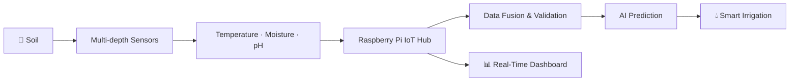
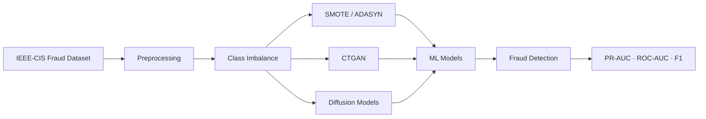

<h1 align="center">Mohamed Amine Boucherit</h1>

<p align="center"><b>Software Developer · AI & Digitalization Enthusiast</b></p>

<p align="center">
  
</p>

<p align="center">
  <a href="https://github.com/hostinghosting144-star">
    
  </a>
</p>

<p align="center">
  
  
  
  
</p>

<p align="center">
  <a href="https://github.com/hostinghosting144-star">
    
  </a>
  <a href="https://www.linkedin.com/">
    
  </a>
  <a href="https://hostinghosting144-star.github.io/Portfolio/">
    
  </a>
  
</p>

---

## 👋 About me

I'm **Mohamed Amine**, a **Software Developer and Master's student in Artificial Intelligence and Digitalization** at **Ibn Khaldoun University of Tiaret, Algeria**.

I build systems where **software, artificial intelligence, data and real-world applications meet** — from web and mobile applications to machine learning systems, IoT platforms and digital twins.

My interests include **Artificial Intelligence, Machine Learning, Data Science, Cybersecurity, Web Development, IoT, Digital Twins and Digital Transformation**.

<table>
  <tr>
    <td>🎓 <b>Education</b></td>
    <td>Master 2 – Artificial Intelligence & Digitalization, Université Ibn Khaldoun de Tiaret</td>
  </tr>
  <tr>
    <td>💼 <b>Now</b></td>
    <td>Software & Digital Solutions at Tassyir Digital Agency</td>
  </tr>
  <tr>
    <td>🧠 <b>Previously</b></td>
    <td>AI Intern at SIINE Academy</td>
  </tr>
  <tr>
    <td>🔭 <b>Focus</b></td>
    <td>AI · Software Development · Data Science · IoT · Digital Twins</td>
  </tr>
  <tr>
    <td>🌍 <b>Languages</b></td>
    <td>Arabic · French · English</td>
  </tr>
</table>

> **Software → Data → AI/ML → Intelligent Systems → IoT → Real-World Applications**

---

## 🤖 Featured Project

### Real-Time Monitoring and Autonomous Smart Irrigation Based on Soil Moisture Profiling

An **IoT and AI-based agricultural monitoring platform** designed to build a multi-depth representation of soil conditions and support intelligent irrigation decisions.



* 🌱 **Multi-depth soil monitoring** for agricultural environments
* 📡 **Wireless sensor network** using NRF24L01
* 🧠 **AI-based prediction** for adaptive irrigation
* 🖥️ **Raspberry Pi** as the central IoT processing unit
* 📊 **Real-time monitoring dashboard** with soil profiling
* 🔎 **Data fusion and sensor validation** for detecting unreliable measurements
* 🌍 Designed for **semi-arid agriculture and water optimization**

> ⚠️ **Status:** TRL-4 — laboratory prototype and validation stage.

---

## 💳 AI Research Project

### Enhancing Fraud Detection Through Synthetic Tabular Data Augmentation

Research project focused on improving **financial fraud detection** using synthetic data generation and machine learning.



* 💳 **IEEE-CIS Fraud Detection Dataset**
* ⚖️ Analysis of severe class imbalance
* 🔄 **SMOTE & ADASYN**
* 🤖 **CTGAN**
* 🧬 Synthetic tabular data generation
* 🧠 Machine learning classification
* 📊 PR-AUC, ROC-AUC, Precision, Recall and F1-score
* 🔬 Comparative evaluation of augmentation strategies

---

## 🛠️ Other Projects

| Project                          | What it does                                                      | Stack                                              | Links                                                                                                                            |
| -------------------------------- | ----------------------------------------------------------------- | -------------------------------------------------- | -------------------------------------------------------------------------------------------------------------------------------- |
| 🌾 **AgriTwin**                  | Real-time agricultural monitoring and intelligent irrigation      | Raspberry Pi · NRF24L01 · FastAPI · WebSocket · AI | [Repository](https://github.com/hostinghosting144-star)                                                                          |
| 💳 **Fraud Detection**           | Fraud classification with synthetic tabular data augmentation     | Python · XGBoost · Random Forest · SMOTE · CTGAN   | [Repository](https://github.com/hostinghosting144-star)                                                                          |
| 🎓 **Wonder School**             | Online education and school management platform                   | Vue 3 · Vite · Tailwind · FastAPI · PostgreSQL     | [Repository](https://github.com/hostinghosting144-star)                                                                          |
| 🧠 **Recommendation System**     | Personalized product recommendation using collaborative filtering | Java · JavaFX · Cosine Similarity                  | [Repository](https://github.com/hostinghosting144-star)                                                                          |
| 🎮 **MAZE GARDEN**               | Interactive web platform for games and puzzles                    | HTML5 · CSS3 · JavaScript                          | [Live](https://hostinghosting144-star.github.io/MAZE_GARDEN./) · [Source](https://github.com/hostinghosting144-star/MAZE_GARDEN) |
| 🌐 **Personal Portfolio**        | Responsive developer portfolio                                    | HTML5 · CSS3 · JavaScript                          | [Live](https://hostinghosting144-star.github.io/Portfolio/)                                                                      |
| 📱 **Web & Mobile Applications** | Client applications and digital solutions                         | Vue · JavaScript · Java · Python                   | [GitHub](https://github.com/hostinghosting144-star)                                                                              |

---

## ⚡ Tech Stack

<table>
  <tr>
    <td valign="top" width="33%">
      <b>🤖 AI & Machine Learning</b><br/><br/>
      Python · Scikit-learn<br/>
      XGBoost · Random Forest<br/>
      SMOTE · ADASYN · CTGAN<br/>
      Neural Networks<br/>
      TensorFlow · PyTorch<br/>
      Data Augmentation
    </td>

```
<td valign="top" width="33%">
  <b>💻 Software Development</b><br/><br/>
  Java · Python · C · JavaScript<br/>
  JavaFX · FastAPI<br/>
  Vue.js · Vite<br/>
  HTML5 · CSS3<br/>
  Tailwind CSS · Bootstrap
</td>

<td valign="top" width="33%">
  <b>📊 Data & Databases</b><br/><br/>
  PostgreSQL · MySQL<br/>
  Supabase · Firebase<br/>
  Pandas · NumPy<br/>
  SQL<br/>
  Data preprocessing<br/>
  Data analysis
</td>
```

  </tr>

  <tr>
    <td valign="top">
      <b>🌐 Web & Mobile</b><br/><br/>
      Vue.js · JavaScript<br/>
      Responsive Design<br/>
      REST APIs<br/>
      FastAPI<br/>
      GitHub Pages
    </td>

```
<td valign="top">
  <b>🌾 IoT & Intelligent Systems</b><br/><br/>
  Raspberry Pi<br/>
  NRF24L01<br/>
  Arduino<br/>
  Sensors & Data Acquisition<br/>
  WebSocket<br/>
  Digital Twins
</td>

<td valign="top">
  <b>🔧 Tools & Platforms</b><br/><br/>
  Git · GitHub<br/>
  Docker<br/>
  IntelliJ IDEA<br/>
  VS Code<br/>
  Linux · Windows<br/>
  AnyLogic
</td>
```

  </tr>
</table>

<p>
  
  
  
  
  
  
  
  
  
  
  
  
  
  
  
  
  
  
  
  
</p>

---

## 🏆 Experience & Projects

<details open>
<summary><b>Professional Experience</b></summary>
<br/>

| Role                                  | Organization           | Period              |
| ------------------------------------- | ---------------------- | ------------------- |
| 💼 **Software & Digital Solutions**   | Tassyir Digital Agency | Apr 2026 – Present  |
| 🤖 **Artificial Intelligence Intern** | SIINE Academy          | Jan 2026 – Apr 2026 |

</details>

<details>
<summary><b>Research & Academic Work</b></summary>
<br/>

* **Fraud Detection Through Synthetic Tabular Data Augmentation**
* **Real-Time Monitoring and Autonomous Smart Irrigation**
* **Digital Twin for Agricultural Monitoring**
* **E-commerce Warehouse Management Simulation — AnyLogic**
* **Machine Learning & Data Science Projects**
* **Web & Mobile Application Development**

</details>

---

## 🎯 Areas of Interest

<p align="center">
  
  
  
  
  
  
</p>

---

## 📊 GitHub Statistics

<p align="center">
  
</p>

<p align="center">
  
</p>

<p align="center">
  
</p>

---

## 🌐 Portfolio

<p align="center">
  <a href="https://hostinghosting144-star.github.io/Portfolio/">
    
  </a>
</p>

---

## 🤝 Let's build something

I'm open to collaboration on **Artificial Intelligence, Machine Learning, Software Development, Data Science, IoT, Digital Twins, Cybersecurity and innovative digital solutions**.

<p align="center">
  <a href="https://github.com/hostinghosting144-star">
    
  </a>
  <a href="https://hostinghosting144-star.github.io/Portfolio/">
    
  </a>
</p>

<p align="center">
  <i>"Building intelligent software for real-world problems."</i>
</p>
